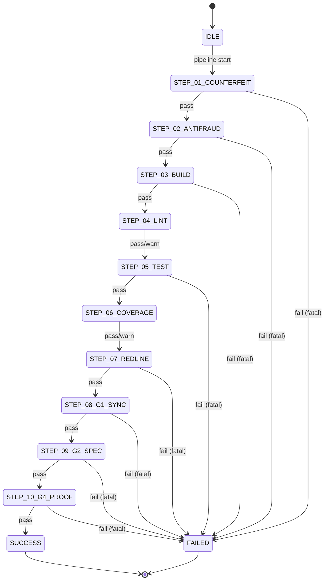
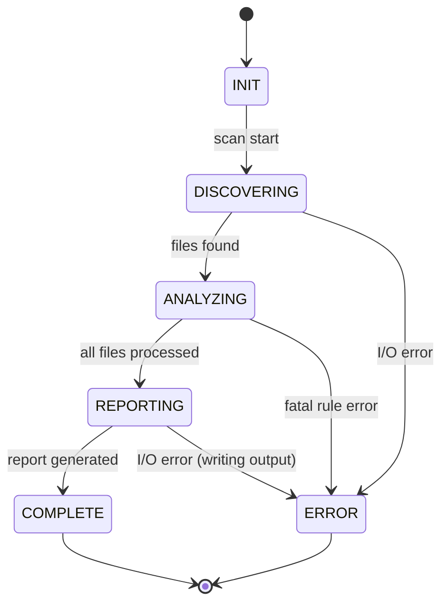
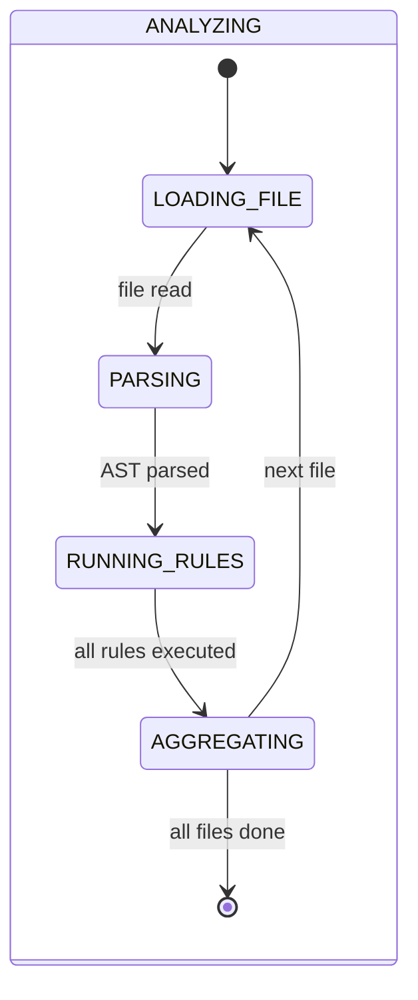
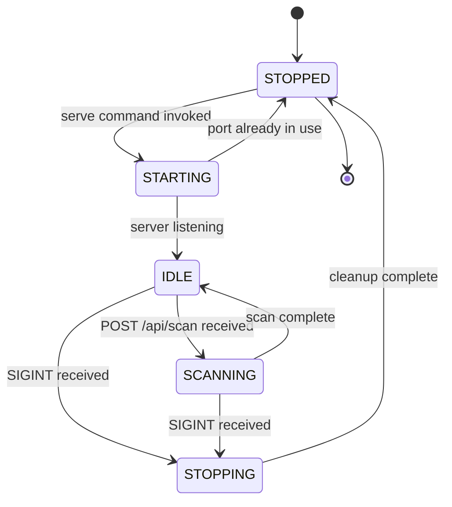
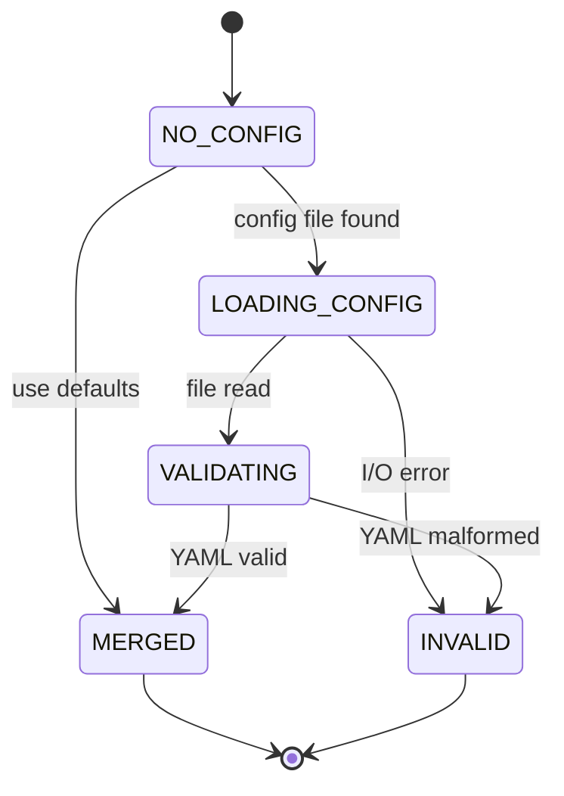
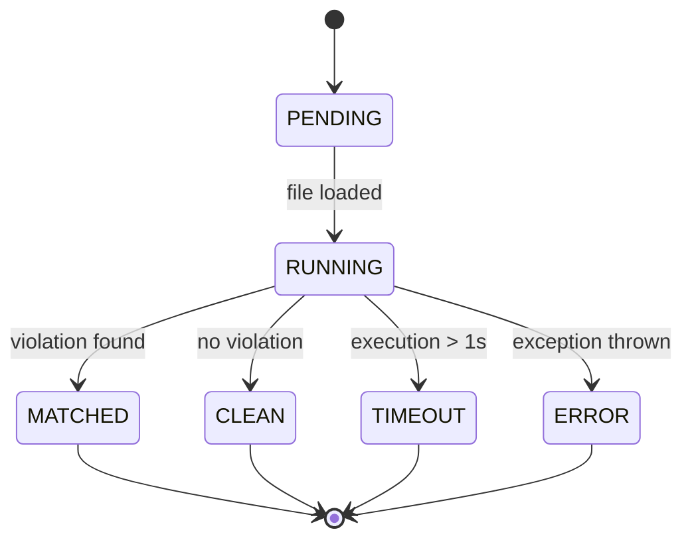
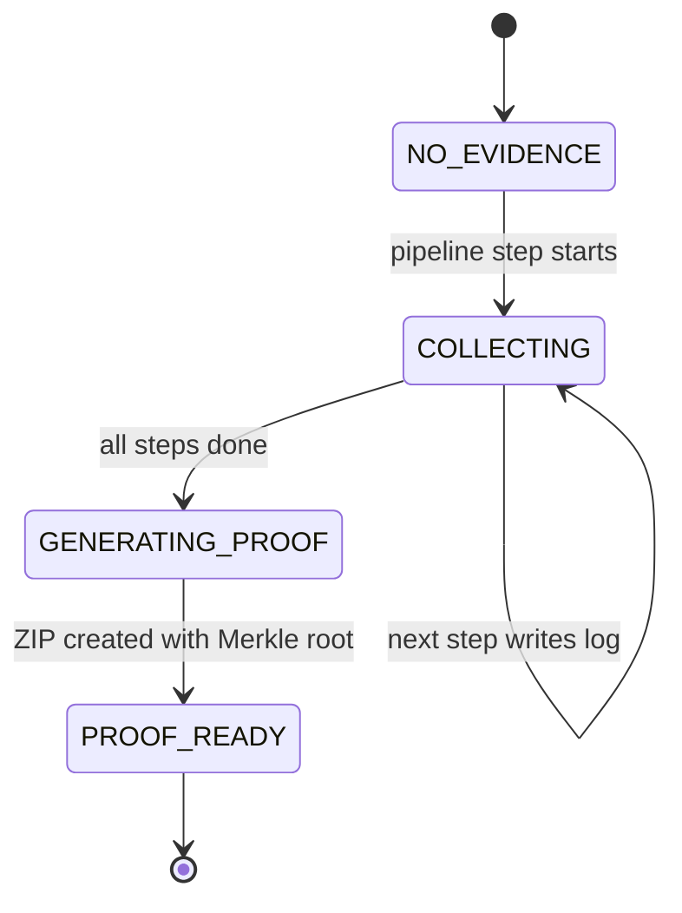

# State Model - MAIDOS-CodeQC

## Overview

This document defines the state machines governing MAIDOS-CodeQC's operational flows. Two primary state models are documented: Pipeline Execution and Scan Lifecycle.

---

## 1. Pipeline Execution State Machine

### 1.1 States

| State | Description | Duration (typical) |
|-------|-------------|-------------------|
| `IDLE` | Pipeline not started | N/A |
| `STEP_01_COUNTERFEIT` | Running anti-counterfeiting check (LV1-5) | 1-2 seconds |
| `STEP_02_ANTIFRAUD` | Running anti-fraud scan (R13-R18) | 2-5 seconds |
| `STEP_03_BUILD` | Running build command (`npm run build`) | 10-60 seconds |
| `STEP_04_LINT` | Running linter (`npm run lint`) | 5-15 seconds |
| `STEP_05_TEST` | Running test suite (`npm test`) | 10-120 seconds |
| `STEP_06_COVERAGE` | Checking code coverage | 2-5 seconds |
| `STEP_07_REDLINE` | Running full redline scan (R01-R28) | 3-10 seconds |
| `STEP_08_G1_SYNC` | Checking G1 interface synchronization | 1-2 seconds |
| `STEP_09_G2_SPEC` | Checking G2 spec coverage | 1-2 seconds |
| `STEP_10_G4_PROOF` | Generating G4 final acceptance proof | 2-5 seconds |
| `SUCCESS` | Pipeline completed successfully | N/A |
| `FAILED` | Pipeline failed at critical step | N/A |

### 1.2 State Transitions

### 1.3 Transition Rules

| From State | To State | Condition | Action |
|------------|----------|-----------|--------|
| `IDLE` | `STEP_01_COUNTERFEIT` | CLI invokes `pipeline` command | Initialize evidence directory |
| `STEP_01_COUNTERFEIT` | `STEP_02_ANTIFRAUD` | LV1-5 checks pass | Log evidence to `01-counterfeit.log` |
| `STEP_01_COUNTERFEIT` | `FAILED` | Counterfeit code detected | Exit code 1, halt pipeline |
| `STEP_02_ANTIFRAUD` | `STEP_03_BUILD` | R13-R18 checks pass | Log evidence to `02-antifraud.log` |
| `STEP_02_ANTIFRAUD` | `FAILED` | Fraud patterns detected | Exit code 1, halt pipeline |
| `STEP_03_BUILD` | `STEP_04_LINT` | Build command exits with 0 | Log stdout/stderr to `03-build.log` |
| `STEP_03_BUILD` | `FAILED` | Build command exits with non-zero | Exit code 1, halt pipeline |
| `STEP_04_LINT` | `STEP_05_TEST` | Lint command exits with 0 or warnings | Log to `04-lint.log`, warnings non-fatal |
| `STEP_05_TEST` | `STEP_06_COVERAGE` | All tests pass | Log to `05-test.log` |
| `STEP_05_TEST` | `FAILED` | Any test fails | Exit code 1, halt pipeline |
| `STEP_06_COVERAGE` | `STEP_07_REDLINE` | Coverage checked | Log to `06-coverage.log`, low coverage non-fatal |
| `STEP_07_REDLINE` | `STEP_08_G1_SYNC` | No R01-R28 violations | Log to `07-redline.log` |
| `STEP_07_REDLINE` | `FAILED` | Any redline violation | Exit code 1, halt pipeline |
| `STEP_08_G1_SYNC` | `STEP_09_G2_SPEC` | Interface sync OK | Log to `08-g1.log` |
| `STEP_08_G1_SYNC` | `FAILED` | Interface mismatch | Exit code 1, halt pipeline |
| `STEP_09_G2_SPEC` | `STEP_10_G4_PROOF` | Spec coverage ≥ 80% | Log to `09-g2.log` |
| `STEP_09_G2_SPEC` | `FAILED` | Spec coverage < 80% | Exit code 1, halt pipeline |
| `STEP_10_G4_PROOF` | `SUCCESS` | Proof pack generated | Create ZIP with SHA256 + Merkle root |
| `STEP_10_G4_PROOF` | `FAILED` | Proof generation fails | Exit code 1, halt pipeline |

### 1.4 Fail-Fast Logic

**Fatal Steps** (block progression on failure):
- STEP_01, STEP_02, STEP_03, STEP_05, STEP_07, STEP_08, STEP_09, STEP_10

**Warning Steps** (allow progression with warnings):
- STEP_04 (lint warnings acceptable)
- STEP_06 (low coverage acceptable, logged)

---

## 2. Scan Lifecycle State Machine

### 2.1 States

| State | Description | Duration (typical) |
|-------|-------------|-------------------|
| `INIT` | Scan initialized | < 100 ms |
| `DISCOVERING` | Discovering files to scan | 0.5-2 seconds |
| `ANALYZING` | Running rules on discovered files | 2-10 seconds |
| `REPORTING` | Generating report output | 0.5-1 second |
| `COMPLETE` | Scan finished | N/A |
| `ERROR` | Scan encountered fatal error | N/A |

### 2.2 State Transitions

### 2.3 Transition Rules

| From State | To State | Condition | Action |
|------------|----------|-----------|--------|
| `INIT` | `DISCOVERING` | CLI invokes `scan` command | Parse config, initialize categories |
| `DISCOVERING` | `ANALYZING` | Files discovered successfully | Build file list, filter by extension |
| `DISCOVERING` | `ERROR` | Directory not found or permission denied | Exit with error message |
| `ANALYZING` | `REPORTING` | All files scanned | Aggregate violations by category |
| `ANALYZING` | `ERROR` | Regex timeout or parser crash | Exit with error details |
| `REPORTING` | `COMPLETE` | Report written successfully | Exit code 0 (clean) or 1 (violations) |
| `REPORTING` | `ERROR` | Cannot write output file | Exit with I/O error message |

### 2.4 Substates During Analysis

While in `ANALYZING` state, the scanner processes files sequentially with internal substates:

**Substate Transitions**:
- `LOADING_FILE → PARSING`: Read file content from disk
- `PARSING → RUNNING_RULES`: Parse with Tree-sitter (if supported) or treat as text
- `RUNNING_RULES → AGGREGATING`: Execute 42 rules (filtered by category), collect violations
- `AGGREGATING → LOADING_FILE`: Move to next file in queue
- `AGGREGATING → [*]`: All files processed, return to parent state machine

---

## 3. Serve Mode State Machine

### 3.1 States

| State | Description |
|-------|-------------|
| `STOPPED` | API server not running |
| `STARTING` | Server initializing (loading config, binding port) |
| `IDLE` | Server running, no active scans |
| `SCANNING` | Server processing scan request(s) |
| `STOPPING` | Server shutting down gracefully |

### 3.2 State Transitions

### 3.3 Transition Rules

| From State | To State | Condition | Action |
|------------|----------|-----------|--------|
| `STOPPED` | `STARTING` | CLI invokes `serve --port 3000` | Load config, create HTTP server |
| `STARTING` | `IDLE` | Server binds to port successfully | Log "Server listening on port 3000" |
| `STARTING` | `STOPPED` | Port already in use | Exit with error "Port 3000 is busy" |
| `IDLE` | `SCANNING` | HTTP POST to `/api/scan` | Trigger scan, send WebSocket event |
| `SCANNING` | `IDLE` | Scan completes | Send results via WebSocket, HTTP 200 |
| `IDLE` | `STOPPING` | Ctrl+C (SIGINT) | Close WebSocket connections, stop HTTP |
| `SCANNING` | `STOPPING` | Ctrl+C (SIGINT) | Wait for in-flight scans, then close |
| `STOPPING` | `STOPPED` | All connections closed | Log "Server stopped gracefully" |

### 3.4 Concurrent Scans

In `SCANNING` state, the server can handle up to 10 concurrent scan requests. Each request spawns a child scan lifecycle (Section 2) with isolated state.

**Concurrency Model**:
- Request 1: `ANALYZING` (file 50/100)
- Request 2: `DISCOVERING` (just started)
- Request 3: `REPORTING` (almost done)

All requests share the same `SCANNING` state but maintain independent scan contexts.

---

## 4. Config Loading State Machine

### 4.1 States

| State | Description |
|-------|-------------|
| `NO_CONFIG` | No config file provided |
| `LOADING_CONFIG` | Reading `.codeqcrc.yml` |
| `VALIDATING` | Parsing and validating YAML |
| `MERGED` | Config merged with defaults |
| `INVALID` | Config file malformed |

### 4.2 State Transitions

### 4.3 Transition Rules

| From State | To State | Condition | Action |
|------------|----------|-----------|--------|
| `NO_CONFIG` | `LOADING_CONFIG` | `.codeqcrc.yml` exists in project root | Read file |
| `NO_CONFIG` | `MERGED` | No config file found | Use `DEFAULT_CONFIG` |
| `LOADING_CONFIG` | `VALIDATING` | File read successfully | Parse YAML |
| `LOADING_CONFIG` | `INVALID` | File not readable (permissions) | Exit with error |
| `VALIDATING` | `MERGED` | YAML schema valid | Merge with defaults |
| `VALIDATING` | `INVALID` | YAML syntax error or invalid keys | Exit with error + line number |

---

## 5. Rule Execution State Machine

### 5.1 States (Per Rule, Per File)

| State | Description |
|-------|-------------|
| `PENDING` | Rule not yet executed |
| `RUNNING` | Rule executing on file |
| `MATCHED` | Rule found violation(s) |
| `CLEAN` | Rule found no violations |
| `TIMEOUT` | Rule exceeded 1 second timeout |
| `ERROR` | Rule crashed (regex error, parser error) |

### 5.2 State Transitions

### 5.3 Transition Rules

| From State | To State | Condition | Action |
|------------|----------|-----------|--------|
| `PENDING` | `RUNNING` | File content loaded, category enabled | Execute regex or AST query |
| `RUNNING` | `MATCHED` | Regex match or AST pattern found | Create `Violation` object |
| `RUNNING` | `CLEAN` | No match after scanning entire file | No action |
| `RUNNING` | `TIMEOUT` | Execution time > 1 second (ReDoS protection) | Log timeout warning |
| `RUNNING` | `ERROR` | Parser crash or regex compile error | Log error, skip rule |

### 5.4 Parallel Execution

Rules execute **sequentially** per file (42 rules × 1 file), but files are processed in parallel if concurrency is enabled (future optimization).

---

## 6. Evidence Collection State Machine (Pipeline Mode)

### 6.1 States

| State | Description |
|-------|-------------|
| `NO_EVIDENCE` | Evidence directory not created |
| `COLLECTING` | Writing evidence logs |
| `GENERATING_PROOF` | Creating proof pack ZIP |
| `PROOF_READY` | Proof pack complete with hash |

### 6.2 State Transitions

### 6.3 Transition Rules

| From State | To State | Condition | Action |
|------------|----------|-----------|--------|
| `NO_EVIDENCE` | `COLLECTING` | Pipeline starts | Create `./evidence/` directory |
| `COLLECTING` | `COLLECTING` | Each step completes | Write `{step-number}-{name}.log` |
| `COLLECTING` | `GENERATING_PROOF` | Step 10 completes | Read all evidence logs |
| `GENERATING_PROOF` | `PROOF_READY` | ZIP + hash computed | Write `proof/manifest.json` |

---

## Summary

MAIDOS-CodeQC implements 6 primary state machines:

1. **Pipeline Execution** - 10-step linear flow with fail-fast
2. **Scan Lifecycle** - Discovery → Analysis → Reporting
3. **Serve Mode** - HTTP server lifecycle with concurrent scans
4. **Config Loading** - File discovery → validation → merging
5. **Rule Execution** - Per-rule, per-file execution with timeout
6. **Evidence Collection** - Pipeline-specific proof generation

All state machines are deterministic and testable. State transitions are logged in debug mode (`CODEQC_DEBUG=1`).

---

*MAIDOS-CodeQC State Model v0.3.5 -- CodeQC Gate C Compliant*
